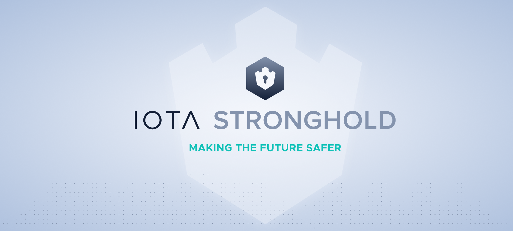

## Introduction
[summary]: #summary

**IOTA Stronghold** is a secure software implementation with the sole purpose of isolating digital secrets from exposure to hackers and accidental leaks. It uses versioned snapshots with double-encryption that can be easily backed up and securely shared between devices. Written in stable rust, it has strong guarantees of memory safety and process integrity. The high-level developer-friendly libraries will integrate the IOTA protocol and serve as a reference implementation for anyone looking for inspiration or best-in-class tooling.

## WARNING
This library has not yet been audited for security, so use at your own peril. Until a formal third-party security audit has taken place, the IOTA Foundation makes no guarantees to the fitness of this library for any purposes.

As such they are to be seen as **experimental** and not ready for real-world applications.

Nevertheless, we are very interested in feedback about the design and implementation, and encourage you to reach out with any concerns or suggestions you may have.

## Project Status
- Low-level libraries (beta quality, fuzzed)
- High-level libraries (under active development)
- FFI Bindings (to-do)
- Rust Actor Wrapper (to-do)

## API Reference
```
cargo doc --workspace --no-deps --open
```

## Running Tests
```
cargo test --all
```

## Joining the discussion
If you want to get involved in discussions about this technology, or you're looking for support, go to the #stronghold-discussion channel on [Discord](https://discord.iota.org/).
