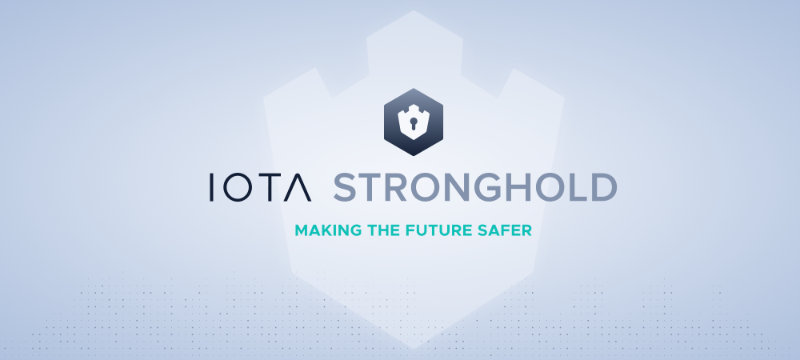

## Introduction
[summary]: #summary

**IOTA Stronghold** is a secure software implementation with the sole purpose of isolating digital secrets from exposure to hackers and accidental leaks. It uses encrypted snapshots that can be easily backed up and securely shared between devices. Written in stable rust, it has strong guarantees of memory safety and process integrity. 

There are four main components of Stronghold:
1. **Client**: The high-level interface to Stronghold (prefers Riker, functional integration also available)
2. **Engine**: Combines a persistence store (Snapshot) with an in-memory state interface (Vault).
3. **Runtime**: Is a process fork with limited permissions within which cryptographic operations take place
4. **Communication**: Enables Strongholds in different processes or on different devices to communicate with each other securely.

## WARNING
This library has not yet been audited for security, so use at your own peril. Until a formal third-party security audit has taken place, the IOTA Foundation makes no guarantees to the fitness of this library for any purposes.

As such they are to be seen as **experimental** and not ready for real-world applications.

Nevertheless, we are very interested in feedback about the design and implementation, and encourage you to reach out with any concerns or suggestions you may have.

## Roadmap
Here are some of the features and tasks that we are working on.

#### Components
- [x] Engine (beta quality, fuzzed)
- [x] Client (with dual interfaces)
- [x] peer-to-peer communications
- [x] Secure runtime zone 
- [x] Integration with crypto.rs 

### Documentation and Specification
- [ ] User Handbooks
- [ ] Specification Documentation
- [ ] Tutorials

### Performance and Testing
- [x] Unit Tests
- [x] Lowlevel Library Fuzzing
- [ ] Realworld tests
- [ ] Multiplatform benchmarks
- [ ] Continuous Fuzzing

#### Applications
- [x] CLI binary
- [ ] Standalone Desktop Application
- [ ] Portable Daemon (for nodes, etc)
- [ ] Dynamic high-performance store 
- [ ] C FFI bindings

### Hardware Integrations
- [ ] Works with USB Armory Mk II
- [ ] Works with Yubikey
- [ ] Works with Ledger Nano X
- [ ] Use Secure Element to generate private keys for decryption
- [ ] Move entirely to FPGA

## API Reference
```
cargo doc --workspace --no-deps --open
```

## Running Tests
```
cargo test --all
```

## Joining the discussion
If you want to get involved in discussions about this technology, or you're looking for support, go to the #stronghold-discussion channel on [Discord](https://discord.iota.org/).
