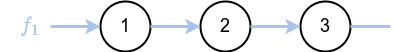
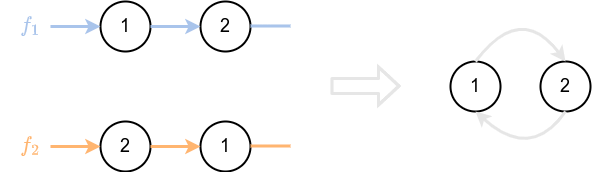
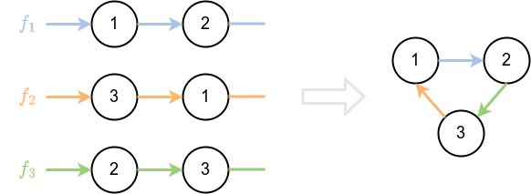
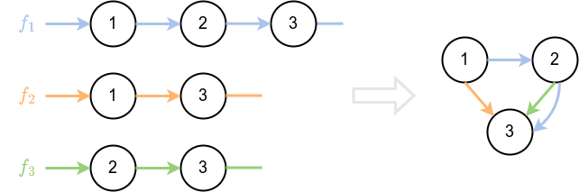
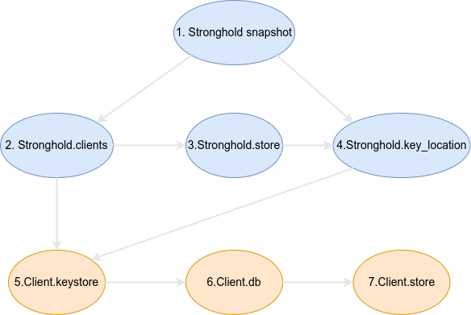

# Deadlock Analysis in Stronghold

Stronghold uses `RwLock` to enable [concurrency](./concurrency.md).
This approach has the pros of being simple in theory and fast performance when done right. The downside is that, in practice, it is usually really difficult to use locks in concurrent programming, and you often encounter _data races_ or _deadlocks_ when using them.
One of the worst cases would be to have a deadlock in Stronghold, which could block Stronghold and render it unusable.
To avoid this situation, Stronghold uses deadlock analysis.

### Requirements for a Multithreaded Stronghold

- Be able to clone the element type parts of the API and use them concurrently. The following types ar reachable through the API and may be cloned and shared between threads:
  - [Stronghold](../reference/structure/overview)
  - [Client](../reference/structure/client.md)
  - [Store](../references/enginge/store.md)
- Use `Mutex` or `RWLock`

## Analysis of deadlocks
This is internal thoughts stemming from experience but does not have peer-reviewed paper backing it.

### Model
Locks are used to control access to shared memory.
To simplify the problem we only model mutex so that only a single thread
can access to a shared memory.

#### Model of function and locks
Here how we represent a function and locks.

- $1$, $2$, $3$ represent locks that protect 3 different and distinct shared memory locations
- $f_1$ is a function that sequentially takes hold of lock $1$ then $2$ then $3$
- $f_1$ releases the locks $1$, $2$, $3$ at the end of its computation 

Here we can see that lock $2$ depends on lock $1$ because in $f_1$ you can't take lock $2$ before taking lock $1$. In the same way lock $3$ depends on locks $1$ and $2$.

#### Example: Deadlock with 2 functions
Here is an example of the most simple possible deadlock.

- the function $f_1$ wants to take the locks for shared memory $1$ then $2$
- the function $f_2$ wants to take the locks for shared memory $2$ then $1$
- on the right you can see that there is a circular dependency of locks between $f_1$ and $f_2$ (you can do a circle by following the arrows of $f_1$ and $f_2$). 

##### Analysis

The graph at the right represents the merged dependency graph of functions $f_1$ and $f_2$. It shows all the dependencies of the locks in $f_1$ and $f_2$.
The presence of a circular dependency on the merged graph indicates the possibility of a deadlock when executing $f_1$ and $f_2$ concurrently.

##### Example run resulting in a deadlock: 
1. $f_1$ starts and takes the lock $1$
2. $f_2$ starts and takes the lock $2$
3. $f_1$ is stuck because $f_2$ is holding the lock $2$ that it requires
4. $f_2$ is stuck because $f_2$ is holding the lock $1$ that it requires

#### Example: Deadlock with 3 functions

As the previous example there is a circular dependency of locks 
between $f_1$, $f_2$ and $f_3$. 
Example run resulting in a deadlock: 
1. $f_1$ starts and takes the lock $1$
2. $f_2$ starts and takes the lock $3$
3. $f_3$ starts and takes the lock $2$
4. $f_1$ is stuck because $f_3$ is holding the lock $2$ that it requires
5. $f_2$ is stuck because $f_1$ is holding the lock $1$ that it requires
6. $f_3$ is stuck because $f_2$ is holding the lock $3$ that it requires

### Proof backing "_no circular dependency equals to no deadlock_"
This is a proof on an example for simplicity. The reasoning used in the next part can be applied to any dependency graph of locks to prove the absence of deadlock when there are no circular dependency.

#### Example: no deadlock

There is no circular dependency in the right-side representation.
We will try to argue that there is indeed no possible deadlock in this configuration.
The main idea linking absence of deadlock with absence of circular dependency is that any thread will always eventually get the lock it's waiting for. Thus it will eventually terminate its computation thus releasing the locks it acquired.

##### Definition: deadlock-free lock
We say a lock is deadlock-free when we can prove that it will never part of a deadlock and will always eventually be released.

#### Proof of the absence of deadlock using the merged graph

1. __Lock $3$ is deadlock-free__. No locks depend on lock $3$. When a thread acquires lock $3$ it will manage to terminate its computation and will always release it
2. __Recursively lock $2$ is deadlock-free__. Lock $2$ has only lock $3$ which depends on it. That means:
  a) if a thread acquires lock $2$ it will eventually get lock $3$ because lock $3$ is deadlock-free (lock $3$ will always be available at some point)
  b) if a thread acquires lock $2$ it will manage to terminate its computation and eventually be released because lock $3$ is deadlock-free
  c) lock $2$ is deadlock-free by recursivity
3. __Recursively lock $1$ is deadlock-free__. All the locks that depend on lock $1$ are deadlock-free. Reasoning for lock $2$ can be also applied to lock $1$.

## Stronghold deadlock analysis
The goal is to list the functions of Stronghold that access locks and build a merge graph. Then we show that the merge graph does not contain any circular dependency.
 
### Stronghold shared memories
Here we list the different shared memory locations that are protected behind locks.
Each shared memory location/lock is associated to a number that will be used for the dependency graph we describe after.
 

#### Fields of the `Stronghold` type which are shared memories
1. snapshot: `Snapshot`
2. clients: `HashMap<ClientId, Client>`
3. store: `Store`
4. key_location: `Option<Location>`

#### Fields of the `Client` type which are shared memories
5. keystore: `KeyStore`
6. db: `DbView` 
7. store: `Store`

### Stronghold Functions

Creating one dependency graph per function would be too complicated. Instead, we list every function that accesses the [shared memories](#stronghold-shared-memories).
After the function name, we describe the locks that are acquired or the functions that they call.

#### Functions of the `Stronghold` type

- reset: 
- store:
- load_client_from_snapshot: 1 $\rightarrow$ 2 $\rightarrow$ `client`.restore() 
- load_client: 1 $\rightarrow$ 2 $\rightarrow$ `client`.restore() 
- get_client: 2
- unload_client: 2
- purge_client: 1 $\rightarrow$ 2
- load_snapshot: 1 
- store_snapshot_key_at_location: 1 $\rightarrow$ 4
- create_client: 2 
- commit_with_keyprovider: 1 $\rightarrow$ 2 $\rightarrow$ 5 $\rightarrow$ 6 $\rightarrow$ 7
- commit: 1 $\rightarrow$ 2 $\rightarrow$ 5 $\rightarrow$ 6 $\rightarrow$ 7
- write_client: 1 $\rightarrow$ 2 $\rightarrow$ 5 $\rightarrow$ 6 $\rightarrow$ 7 
- clear: 1 $\rightarrow$ 2 $\rightarrow$ 3 $\rightarrow$ 4 $\rightarrow$  `client`.clear()

#### Functions of the `Client` type
- store: 
- vault:
- vault_exists: 5
- record_exists: 6
- sync_vaults: get_hierarchy() $\rightarrow$ get_diff() $\rightarrow$ export_entries() $\rightarrow$  5 $\rightarrow$ 6
- sync_with: `other_client`.get_hierarchy() $\rightarrow$ get_diff() $\rightarrow$  `other_client`.export_entries() $\rightarrow$ `other_client`.5 $\rightarrow$ 5 $\rightarrow$ 6
- id: 
- restore: 5 $\rightarrow$ 6 $\rightarrow$ 7
- clear: 5 $\rightarrow$ 6 $\rightarrow$ 7
- execute_procedure: execute_procedure_chained()
- execute_procedure_chained: exec_proc()
- get_db: 6
- get_key_provider: 5
- `Runner` trait 
  - get_guards: 5 $\rightarrow$ 6 
  - exec_proc: 5 $\rightarrow$ 6
  - write_to_vault: 5 $\rightarrow$ 6
  - revoke_data: 5 $\rightarrow$ 6
  - garbage_collect: 5 $\rightarrow$ 6
  - resolve_locations: 5
  - get_guard: 5 $\rightarrow$ 6
- `SyncClients` trait
  - get_hierarchy: get_key_provider() $\rightarrow$  get_db()
  - get_diff: get_key_provider() $\rightarrow$  get_db()
  - export_entries: get_db()

 
### Stronghold Merged Graph

This was created by merging all the lock dependencies from the [Stronghold functions](#stronghold-functions).

You can easily see that there are no circular dependencies in this graph.

## Conclusion

This document reassures us of the absence of deadlocks in our multithreaded implementation of Stronghold.

However, the theory presented has not been proven correct to our knowledge. Moreover, creating the merged graph is not exempt from human error either. **This is not proof of the absence of deadlocks**, but an argument and a view on how we designed Stronghold to avoid such a situation.

