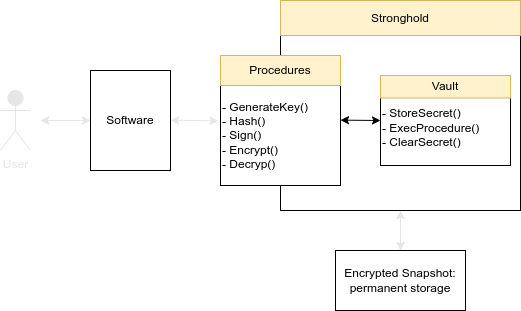

# Stronghold Threat Modeling 

As a security software, Stronghold prevents attackers from accessing the secrets that it stores.
Threat modeling is a systematic approach that tries to assess all the potential 
attack scenarios on software.

There are multiple steps to this process:

1. [Model your software](#model).
2. Define the [assets](#assets) and security property you protect.
3. List [potential threats](#potential-threats-stride) using existing classification (STRIDE in our case).
4. Propose mitigations to those threats

## Stronghold’s Model

Stronghold is simple in concept; it is used to store secrets. 
These secrets should never be revealed, even to their owners. 
Users can interact with secrets through controlled methods called [procedures](explanations/procedures).

### Typical use of Stronghold:

### Typical use of Stronghold

1. [Generate a key in Stronghold](./../../how_tos/cli/generate_key_pair).
2. Use Stronghold procedures to use the key for encryption, decryption, signatures, etc.
3. [Store Stronghold state](./../../how_tos/cli/create_snapshot) for future usage in permanent storage called [Snapshot](../structure/engine/snapshot).

### Model 

- Users can only interact with secrets through the procedures API.
- Users can only use procedures on the secrets they own
- Procedures cannot reveal/temper secrets (can delete them though) 
- Secrets can be kept permanently in an encrypted form in a Snapshot (filesystem)

## Assets

The sole asset of Stronghold is its secrets.

### High Importance

- __Confidentiality__: Secrets are never revealed.
- __Integrity__: Secrets cannot be modified, only deleted.
- __Authentication__: Only authorized users can interact with secrets,

### Mid Importance

- __Availability__: A user can interact with its secrets anytime.

### Low Importance

- __Least privilege__: There are no privileged users in Stronghold.
- __Non-repudiation__: A user can't disprove that it has used a procedure on a secret.

## Attack Surface 

Stronghold defends against multiple types of attackers.
Levels also represent how likely it is for an attacker to appear.

- __Level 1__: [Procedure API](#level-1-procedure-api).
- __Level 2__: [Permanent storage: Snapshot in the filesystem](#level-2-permanent-storage-file-system).
- __Level 3__: [Memory](#level-3-memory):
  - The attacker can read memory.
  - Through cold-boot attacks or memory dumps.
- __Level 4__: [Side-channels](#level-4-side-channels):
  - Timing attacks.
  - Power consumption.

A type of attacker that we don't represent here but is also important comes from potential vulnerabilities in the tools used to build the software.

- __Bonus__: Tools:
  - Packages.
  - Rust language.
  - Compilation.
  - Crypto algorithms used.

## Potential threats STRIDE
We use the [STRIDE](https://owasp.org/www-community/Threat_Modeling_Process) threats classification. 
Stride is applied to all the types of attacks listed [above](#attack-surface).
Mentions of __WIP__ means that it is still "Work In Progress".

### Level 1: Procedure API

| Attack                  | Attack                                                         | Remediation                                                                               | Severity |
|-------------------------|----------------------------------------------------------------|-------------------------------------------------------------------------------------------|----------|
| Spoofed                 | An unauthorized user executes procedures                       | When restoring Stronghold state from a snapshot a key is required to decrypt the snapshot | High     |
| Tampered                | Secrets are tampered with using procedures                     | Procedures are developed and audited by the team so they don't modify secrets             | High     |
| Repudiated              | A user is accused to have used secrets maliciously/incorrectly | Log all the procedures that have been processed __(WIP)__                                 | Low      |
| Information Disclosure  | A secret is revealed through procedures                        | Procedures are developed and audited by the team to ensure they don't reveal secrets      | High     |
| Denial of Service       | Spamming procedures to block the system                        | This is the responsability of the software that uses                                      | Mid      |
| Elevation of Privileges | None, there are no privileged users in Stronghold              |                                                                                           |          |

### Level 2: Permanent Storage, File System

| Attack                  | Attack                                                                                                          | Remediation                                                                                                                 | Severity |
|-------------------------|-----------------------------------------------------------------------------------------------------------------|-----------------------------------------------------------------------------------------------------------------------------|----------|
| Spoofed                 |                                                                                                                 | OS responsibility                                                                                                           |          |
| Tampered                | Files storing the secrets are modified. Secrets can be lost.                                                    | Check the integrity of snapshot with a checksum. Keep an older snapshot to be able to restore the correct state             | High     |
| Repudiated              |                                                                                                                 | OS responsibility                                                                                                           |          |
| Information Disclosure  | Snapshot content is read                                                                                        | Snapshot content is encrypted                                                                                               | High     |
| Denial of Service       | Host file system is unavailable. Stronghold cannot commit its current state or load a previous state            | Stronghold can continue, but can't commit                                                                                   | Mid      |
| Elevation of Privileges | Attacker has elevated privilege on the host machine, and can read, write or delete snapshots on the file system | Same case as Tampered and Info Disclosure attacks, the snapshot is encrypted and can be restored if it has a valid checksum | High     |

### Level 3: Memory

| Attack                  | Attack                                                                                                     | Remediation                                                                                                                                                      | Severity |
|-------------------------|------------------------------------------------------------------------------------------------------------|------------------------------------------------------------------------------------------------------------------------------------------------------------------|----------|
| Spoofed                 |                                                                                                            | OS responsibility                                                                                                                                                |
| Tampered                | Host system gets its memory corrupted. Procedures will produce wrong outputs, so original data can be lost | Secrets are backed by permanent a storage called Snapshot. User may use a previous snapshot to restore a previous state                                          | High     |
| Repudiated              |                                                                                                            | OS responsibility                                                                                                                                                |
| Information Disclosure  | Secrets are revealed through reading the memory directly                                                   | Secrets are stored encrypted in the memory and are only decrypted for the minimum amount of time. Moreover the Boojum scheme protects encryption keys in memory. | High     |
| Denial of Service       | Memory is not accessible, preventing Stronghold from working                                               | OS responsibility                                                                                                                                                | Mid      |
| Elevation of Privileges | Attacker has elevated privileges on the host machine and can access the secrets in Stronghold              | Same case as Tampered and Info Disclosure attacks, the snapshot is encrypted and can be restored if it has a valid checksum                                      | High     |

### Level 4: Side-channels

| Attack                      | Attack                                                                                     | Remediation                                                                                                                         | Severity |
|-----------------------------|--------------------------------------------------------------------------------------------|-------------------------------------------------------------------------------------------------------------------------------------|----------|
| Spoofed                     | No potential attack                                                                        |                                                                                                                                     |
| Tampered                    | Tamper memory using side-channels                                                          | Refer to [memory](#level-3-memory) and [storage](#level-2-permanent-storage-file-system) tables                                     | High     |
| Repudiated                  | No potential attack                                                                        |                                                                                                                                     |
| Information Disclosure      | Secrets are revealed through side-channels                                                 | Make sure the procedure are constant in time and energy usage **(WIP)**. This also depends on the cryptographic implementation used | High     |
| Denial of Service           | Prevent normal behaviour of stronghold through side-channels such as electromagnetic waves | You can't protect this from software, it is the host's responsibility                                                               | Mid      |
| ~~Elevation of Privileges~~ | No potential attack                                                                        |                                                                                                                                     |

